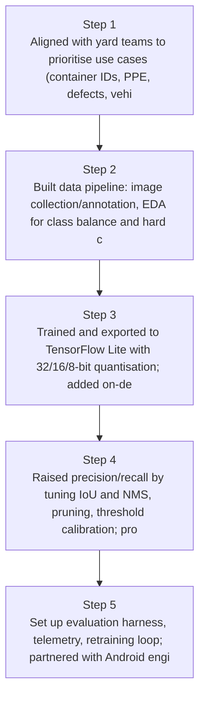
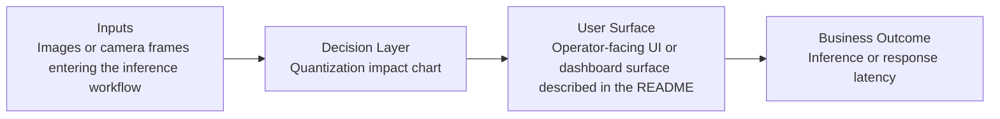
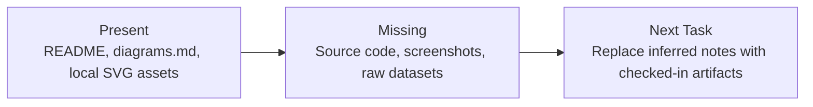

# Android Edge Vision for Logistics Diagrams

Generated on 2026-04-26T04:29:37Z from README narrative plus project blueprint requirements.

## On-device inference pipeline

## Quantization impact chart

## Evidence Gap Map

